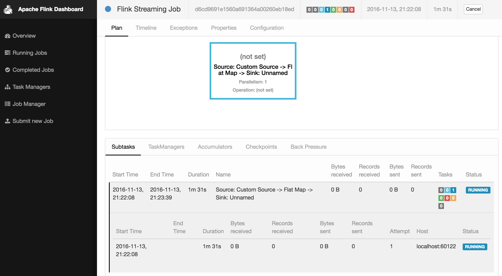

### Processing Rabbitmq's Stream with "Apache Flink"
Read about it here: <a href="http://shekharsingh.com/apache-flink-rabbimq-streams-processor.html">http://shekharsingh.com/apache-flink-rabbimq-streams-processor.html</a>


Execute using (Make sure flink & rabbitmq is up and running):
```bash
flink run -c com.rootcss.flink.RabbitmqStreamProcessor target/flink-rabbitmq-0.1.jar
```

Build using:
```bash
mvn clean package
```

Logs at: 
```bash
tail -f $FLINK_HOME/log/*
```

Open Dashboard:
```bash
http://localhost:8081/
```


Other commands:
```bash
flink run -c com.rootcss.flink.RabbitmqWindowStreamProcessor target/flink-rabbitmq-0.1.jar --output /Users/rootcss/output.out --window 10
flink run -c com.rootcss.flink.RabbitmqMessageRateCalculator target/flink-rabbitmq-0.1.jar --output /Users/rootcss/output2.out
```